# IBMYes

**测速节点已经停用，无法测试**

**自动安装失效**

**本项目初衷是想学习CI/CD以及容器的使用，任何与此无关的问题将不做回复。**

**从fork数量来看，使用人数过多，估计影响到IBM CF的正常使用，所以项目不在更新。**

本项目包括3部分

1. ~~IBM Cloud Fonudray搭建应用~~
2. ~~利用Github的Actions 每周重启 IBM Cloud Fonudray~~
3. ~~Cloudflare 高速节点中转~~

# 使用IBM Cloud Fonudray搭建应用

首先注册https://cloud.ibm.com/

注册步骤略过

登录后点击右侧 创建资源


可以找到Cloud Foundray

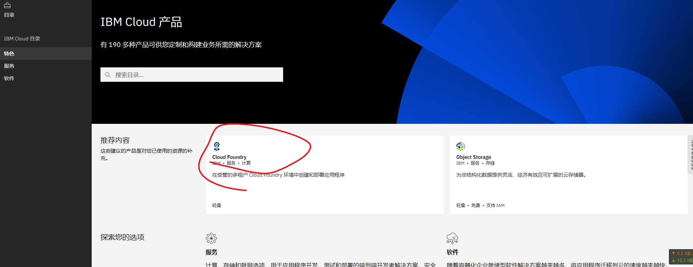

创建公共应用程序

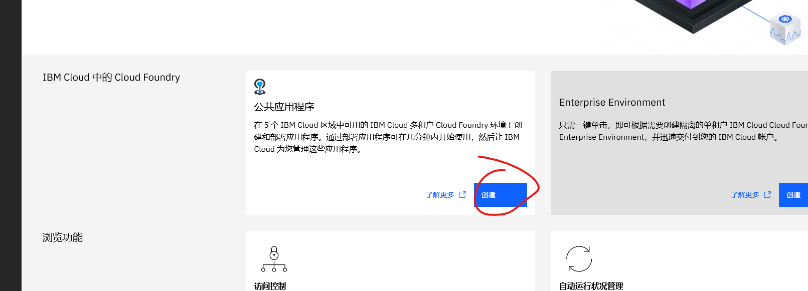

填写相关信息

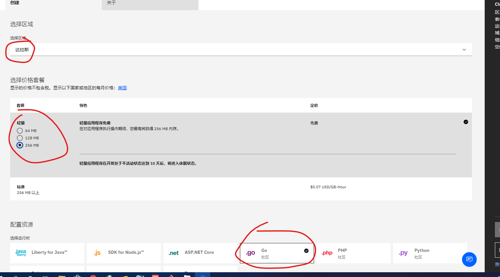

区域必须达拉斯，只有那里有免费的。


填写应用名称

接着进入右上角命令行

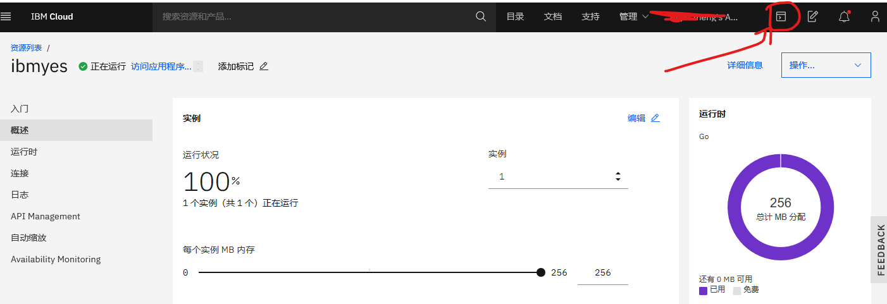

打开命令行，右上角选择相应的地区（Dallas），粘贴一键安装脚本：

```shell
wget --no-check-certificate -O install.sh https://raw.githubusercontent.com/gamekingv/v2-ibm/master/install.sh && chmod +x install.sh  && ./install.sh
```


在配置的时候需要输入应用名称（这里就是我创建应用的时候输入应用名称我输入的是ibmyes，你需要改成你自己的名称）和应用内存大小（我们刚刚选择的是256）

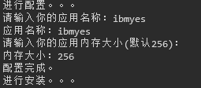

配置好，等待几分钟，便可自动完成安装。完成安装后，将输出随机的UUID 、WebSocket路径以及对应的配置链接：


然后访问我们刚刚的应用的域名，如果不记得可以返回我们刚才的资源，点击访问应用程序

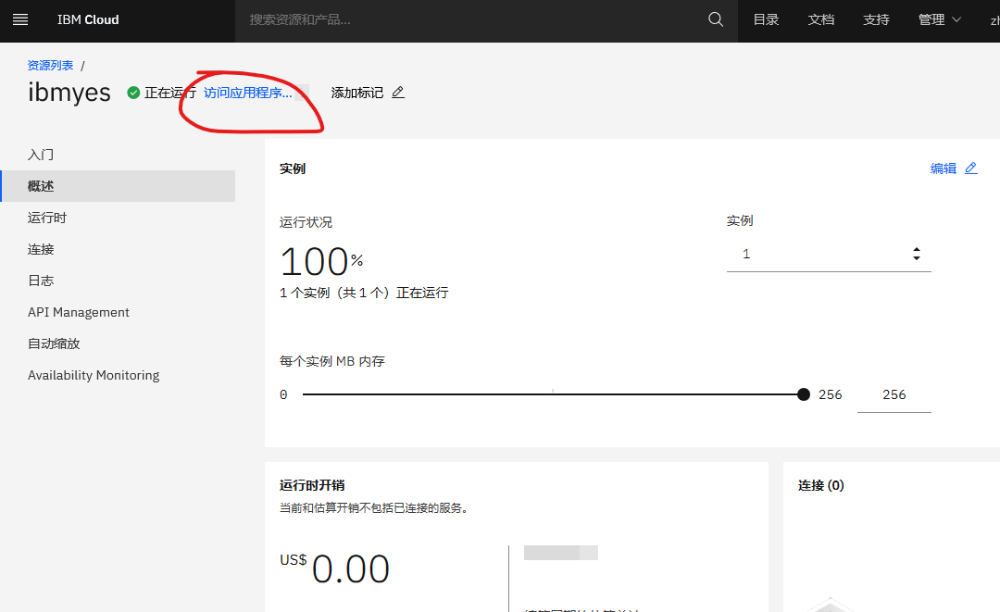

URL后加上生成的WebSocket路径，看到`Bad Request`便成功了


这里请记下你的域名

把完成安装后输出的配置链接复制到你的v2rayN或v2rayNg中，修改地址为你的应用的域名（前面我们`Bad Request`那个网页的域名。

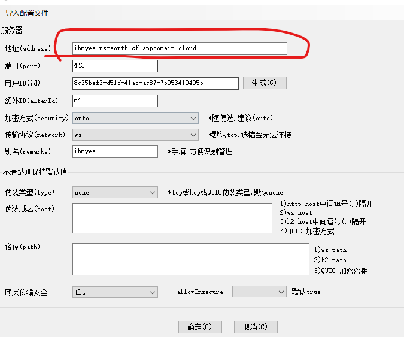

至此我们已经有一个可用的v2ray了，但是他每10天会重启一次，而且网速延迟很差，所以接下来会解决这个问题。

# 利用Github的Actions 每周重启 IBM Cloud Fonudray

IBM Cloud 10天不操作就会关机，所以我们需要 十天内对其重启一次，避免关机。

首先登录IBM Cloud

点击又上角的命令行

在这一步我们主要是记录4个值

 ```
IBM_ACCOUNT // IBM Cloud的登录邮箱和密码
IBM_APP_NAME // 应用的名称
REGION_NUM // 区域编码
RESOURSE_ID // 资源组ID
 ```

具体后面会一步一步完成


进入命令行先执行

```shell
ibmcloud login
```

输入邮箱和密码。

之后记录下区域(Region)


```
#1. au-syd
#2. in-che
#3. jp-tok
#4. kr-seo
#5. eu-de
#6. eu-gb
#7. us-south
#8. us-east
```

这里需要记下和区域对应的编号也就是`REGION_NUM`，比如我这里是us-south,那么我的区域编号是`7`

接下来获取资源组id`RESOURSE_ID`

```shell
ibmcloud resource groups
```


图中所指向便是`RESOURSE_ID`

现在返回github，到本项目

```
https://github.com/CCChieh/IBMYes
```


右上角fork到自己的github下，然后进入setting


选择Secrets

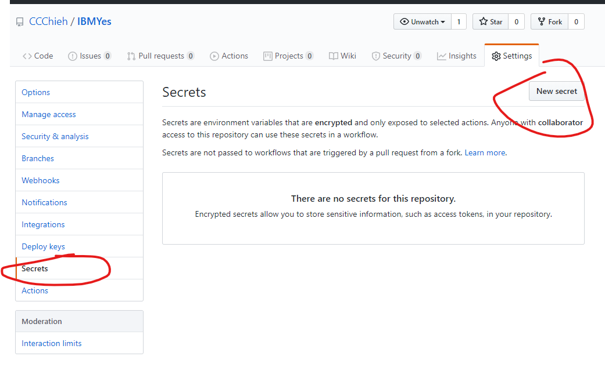

New secret

分别建立四个secret

```
IBM_ACCOUNT // IBM Cloud的登录邮箱和密码
IBM_APP_NAME // 应用的名称
REGION_NUM // 区域编码
RESOURSE_ID // 资源组ID
```


以`IBM_ACCOUNT`为例

第一行为邮箱，第二行为密码。

这里需要邮箱和密码所以中间换行 ，其他的不需要换行 。

把四个secret补充完成

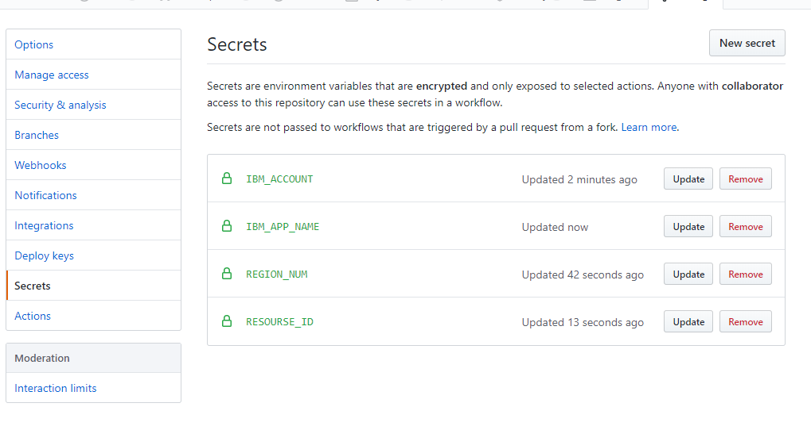

之后点击上方Actions，在这里你就会看到有个IBM Cloud Auto Restart在执行。


如果没有看见Action的话到自己仓库的`/.github/workflows/ibm.yml`

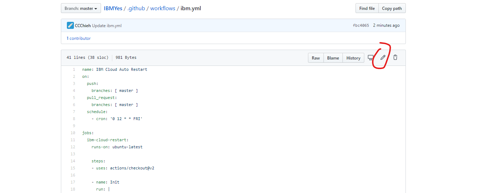

编辑下，随意增添个空行然后commit下


就可以看见有action了

第一次可能因为secret没添加导致workflow执行失败，只需要点下


进去后按照下图


找到 `Re-run jobs`重新执行一次即可，至此自动重启已经ok了。

> 感谢药油@[My Flavor](https://yaohuo.me/bbs/userinfo.aspx?touserid=24109)，原本打算弄bash在自己服务器定期执行脚本，现在看了他的帖子，发现用Actions是一个更好的选择。

# Cloudflare 高速节点中转

> 此部分贡献来自药油@[Joyace](https://yaohuo.me/bbs/userinfo.aspx?touserid=5461)、@[老婆](https://yaohuo.me/bbs/userinfo.aspx?touserid=21843)以及@[小俊博客](https://www.xjisme.com/)

cloudflare官网：https://www.cloudflare.com/

注册，登录这里不再累述。

登录后左上角点击菜单找到workers

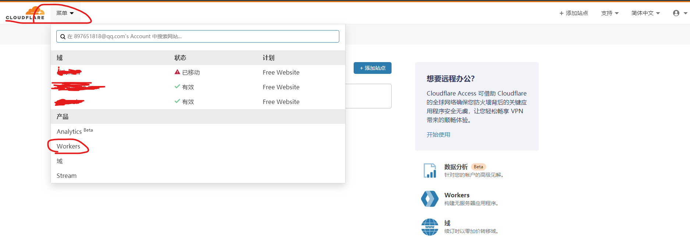

创建Worker


打开和复制脚本

```
addEventListener(
"fetch",event => {
let url=new URL(event.request.url);
url.hostname="ibmyes.us-south.cf.appdomain.cloud";
let request=new Request(url,event.request);
event. respondWith(
fetch(request)
)
}
)
```

修改第四行为你的应用的域名

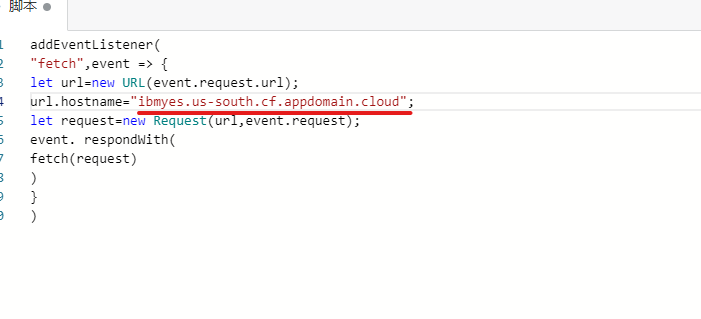

点击发送，测试是否出现`Bad Request`，出现则成功，点击保存并部署。

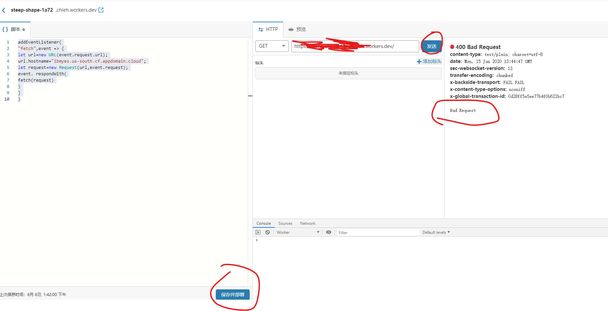

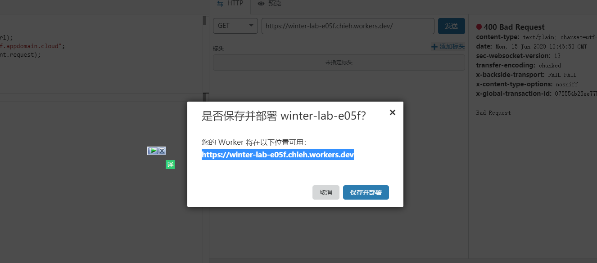

这里会给一个网址，\*.\*.workers.dev,这就是你的cloudflare中转后的域名。

然后我们去v2的客户端中修改地址

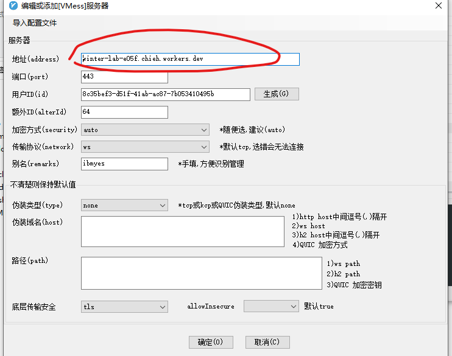

现在已经使用了cloudflare的代理。

下面我们将筛选cloudflare的高速节点。

克隆本项目到你的电脑上。

打开项目下的`fping-msys2.0`目录运行`自动查找最优CF节点-懒人专用.bat`


这里假设我获取的最优ip是`104.17.188.91`

在客户端把地址换成ip，伪装域名换成我们cloudflare的workers的域名即可

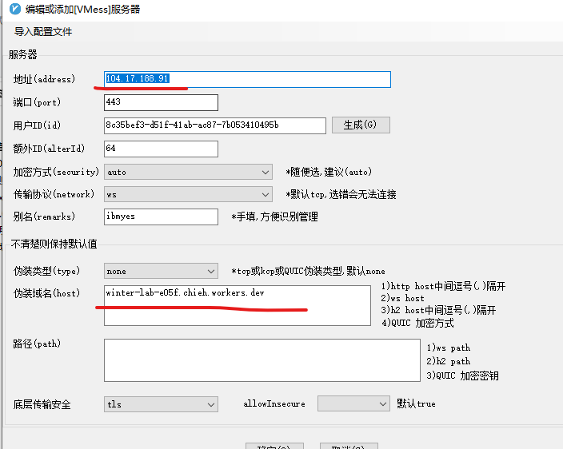

如果不方便用电脑优选ip也可以把地址设为`cloudflare.com`或`icook.tw`,这两个一个cloudflare官网，自然也是使用自家cdn，另外一家是台湾省的一个网站，域名指向的ip一般也是比较好的线路。

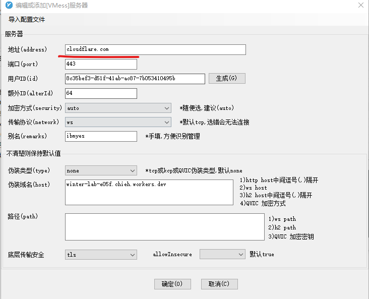

这里稍微提下原理吧，主要涉及CDN和请求头部，CDN识别流量是访问哪个网站的是根据请求头的Host来识别，所以这里要么host用我们的域名 ，要么我们伪装成我们的域名，这样都可以达到回源我们网站的请求。如果自己有域名也可以换自己的域名，域名也可以从第三方接入商cname，有兴趣的同学可以自己研究下。